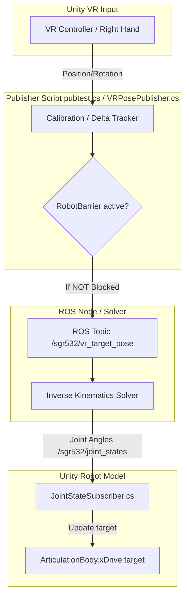

# Robot Segment Position and Rotation Control System

This document describes how the positions and rotations of the robot segments (joints and links) are controlled and updated in the Unity project.

---

## 1. System Overview

The project uses a hybrid loop combining VR controller input, ROS (Robot Operating System) communication, and Unity physics (`ArticulationBody`) to command and visualize the robot arm (likely a **SGR532** model). 

The control loop functions in two main directions:
1. **Outward Control (Unity VR → ROS):** Translates real-time VR controller movements into end-effector goal poses and publishes them to ROS.
2. **Inward Control (ROS → Unity Articulation Bodies):** Receives the calculated joint states back from ROS and applies them to the physical robot segments in Unity.



---

## 2. Inward Control: ROS to Unity Joint States

The actual physical movement/rotation of the robot segments in Unity is controlled by [JointStateSubscriber.cs](file:///D:/Aidan/REU2026/Samuel/Samuel/Sam's%20Robot%20Shop/Assets/Scripts/JointStateSubscriber.cs).

### Mapping
The script maps ROS joint names to the Unity GameObjects representing each robot link:
* `"joint1"` ➔ `sgr532/link1`
* `"joint2"` ➔ `sgr532/link2`
* `"joint3"` ➔ `sgr532/link3`
* `"joint4"` ➔ `sgr532/link4`
* `"joint5"` ➔ `sgr532/link5`
* `"joint6"` ➔ `sgr532/link6`
* `"joint_gripper_right"` ➔ `sgr532/link_gripper_right`
* `"joint_gripper_left"` ➔ `sgr532/link_gripper_left`

### Update Loop
1. The script subscribes to the `/sgr532/joint_states` topic via `ROSConnection`.
2. Upon receiving a `JointStateMsg` message, the subscriber converts the incoming joint angle positions from **radians to degrees** (`Mathf.Rad2Deg`).
3. For each mapped joint, it obtains the [ArticulationBody](https://docs.unity3d.com/Manual/class-ArticulationBody.html) component and updates its drive target:
   ```csharp
   var drive = joint.xDrive;
   drive.target = jointPosition;
   joint.xDrive = drive;
   ```
This updates Unity's physics joint-drives, prompting the physics engine to rotate and position each robot segment accordingly.

---

## 3. Outward Control: VR Input to ROS target Pose

To drive the robot, target commands are sent to ROS. This is managed by [pubtest.cs](file:///D:/Aidan/REU2026/Samuel/Samuel/Sam's%20Robot%20Shop/Assets/Scripts/pubtest.cs) (with legacy equivalents in [VRPosePublisher.cs](file:///D:/Aidan/REU2026/Samuel/Samuel/Sam's%20Robot%20Shop/Assets/Scripts/VRPosePublisher.cs) and [VRPosePublisher2.cs](file:///D:/Aidan/REU2026/Samuel/Samuel/Sam's%20Robot%20Shop/Assets/Scripts/VRPosePublisher2.cs)).

1. **Calibration:**
   At startup, the script waits `calibrationDelay = 10f` (10 seconds) for initialization. Once this delay passes, it locks the right VR controller's position and rotation in the Forward-Left-Up (FLU) coordinate system as the "home" origin (`controllerHomeFlu`, `controllerHomeRotation`).
2. **Delta Command Calculation:**
   Every frame, the script reads the right controller's current position and rotation, converts them to the ROS-compatible FLU representation, and computes the offset delta from the home origin.
3. **Reference Target:**
   The offset delta is added to a hardcoded target end-effector home position:
   `rosEEHomeInBaseLink = new Vector3(0.308f, 0.00045f, 0.304f)`
4. **Publishing target Pose:**
   A `PoseStampedMsg` (containing the header, calculated position, and delta rotation) is published to the topic `/sgr532/vr_target_pose`.
5. **Teach and Repeat:**
   If the save button (menu button on the right controller) is pressed, the target pose is also published to `/sgr532/teach_pose`.
6. **Gripper Control:**
   The right and left controller triggers increment or decrement the target gripper width value, publishing it to `/sgr532/gripper/command`.

---

## 4. Barrier & Safety Blocking Mechanism

A safety mechanism is in place to prevent the robot from going into forbidden zones.

* **Tracking the Target:** [RobotTargetVisualizer.cs](file:///D:/Aidan/REU2026/Samuel/Samuel/Sam's%20Robot%20Shop/Assets/Scripts/RobotTargetVisualizer.cs) uses the same VR controller tracking delta to move a virtual target detector (`robotBarrierDetector`) representing the robot's intended end-effector path.
* **Collision Check:** The visualizer tracks 3 child trigger points (`TriggerPt1`, `TriggerPt2`, `TriggerPt3`) and sends them to [RobotBarrier.cs](file:///D:/Aidan/REU2026/Samuel/Samuel/Sam's%20Robot%20Shop/Assets/Scripts/RobotBarrier.cs).
* **RobotBarrier:**
  * Iterates through all its child colliders.
  * Uses geometric checks (type-aware distance-to-radius math for `SphereCollider`, and bounding-box `Contains` tests for other colliders) to see if the trigger points are inside.
  * Toggles the visibility (`MeshRenderer`) of the violated/cleared barrier child zones.
  * Supports inverted check tags (`robot_barrier_inverted` implies points must stay *inside* the zone; going outside triggers a violation).
* **Blocking Publisher:**
  If a barrier violation is detected, `RobotBarrier.isCollisionActive` is set to `true`. When active, `pubtest.cs` **blocks publishing** to `/sgr532/vr_target_pose` and `/sgr532/gripper/command`, causing the robot to freeze and ignore further commands until the VR controller returns to a safe zone.
